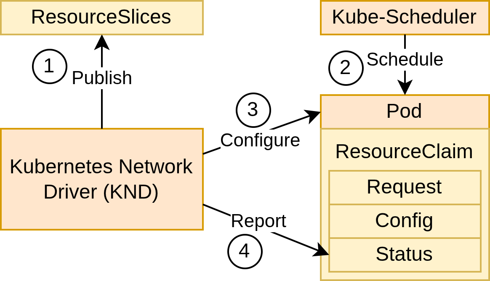

# Kubecon NA 2025 - Kubernetes Network Driver (KND)

Kubecon NA 2025 Keynote demo of the Kubernetes Network driver (KND) concept.

[Keynote: The Community-Driven Evolution of the Kubernetes Network Driver](https://sched.co/27FYh)
* Lionel Jouin, Software Engineer, Red Hat
* Antonio Ojea, Staff Software Engineer, Google

Thursday November 13, 2025 | 9:32am - 9:47am | Building B | Level 1 | Exhibit Hall B2

## Run This Demo

Create and configure the Kind Cluster
```sh
# Create a Kind Cluster
kind create cluster --config docs/demo/kind.yaml
# Add Dummy interfaces in the kind-worker
docker exec -it kind-worker ip link add dummy0 type dummy
docker exec -it kind-worker ip link set dummy0 up
```

Deploy the driver
```sh
# Deploy the Kubecon-NA-2025-KND driver
kubectl apply -f deployments/kubecon-na-2025-knd.yaml
# Create the device class
kubectl apply -f docs/demo/deviceclass.yaml
```

Deploy the demo
```sh
kubectl apply -f docs/demo/pod.yaml
```

More information is available in [docs](./docs)

## How it works

1. Publish: discover available network resources in the cluster and expose them in ResourceSlices.
   - The kubecon-na-2025-knd driver periodically scans the node for available network interfaces via the [github.com/vishvananda/netlink](https://github.com/vishvananda/netlink) module and publishes them within ResourceSlices.
2. Schedule: Schedule the pods based on its specification and resources requested.
   - In the demo, the pod requests a dummy interface (DeviceClass) with an MTU less than or equal to 1500. Kubernetes schedules the pod accordingly.
3. Configure: Allocate and configure the requested network devices to the pod.
   - The kubecon-na-2025-knd driver intercepts container creation through NRI, determines the interface(s) to configure, and adds it to the Linux NetDevice of the container. When runc creates the container, it moves the interface from the host into the network namespace of the pod.
4. Report: Update the status in the ResourceClaim device status for the device(s) configured.
   - After configuration, the kubecon-na-2025-knd driver reports back via the Kubernetes API, setting details such as the network device name, IP address(es), and hardware (MAC) address in the ResourceClaim device status.



## Kubernetes Network Drivers (KND)

* [kubernetes-sigs/CNI-DRA-Driver](https://github.com/kubernetes-sigs/cni-dra-driver)
* [google/DRANET](https://github.com/google/dranet)
* [SchSeba/DRA-Driver-SR-IOV](https://github.com/SchSeba/dra-driver-sriov)

## Community

* Multi-Network Sub-Project
   * [Slack](https://kubernetes.slack.com/archives/C03UT5H9KDZ)
   * [Agenda and Meeting Notes](https://docs.google.com/document/d/1pe_0aOsI35BEsQJ-FhFH9Z_pWQcU2uqwAnOx2NIx6OY/edit?tab=t.0)
   * [Zoom Meeting](https://zoom.us/j/95680858961?pwd=M1c2TTdMZHpMUUtIYXRpbjRobkNJZz09)

* SIG-Network
   * [Slack](https://kubernetes.slack.com/archives/C09QYUH5W)
   * [Agenda and Meeting Notes](https://www.google.com/url?q=https://docs.google.com/document/d/1_w77-zG_Xj0zYvEMfQZTQ-wPP4kXkpGD8smVtW_qqWM/edit%23&sa=D&source=calendar&ust=1760801376431357&usg=AOvVaw0_1Ukb5AvHwuvvF7DmrUbA)
   * [Zoom Meeting](https://zoom.us/wc/361123509/join)
   * [Google Group](https://groups.google.com/g/kubernetes-sig-network)

* WG Device Management
   * [Slack](https://kubernetes.slack.com/archives/C0409NGC1TK)
   * [Agenda and Meeting Notes](https://docs.google.com/document/d/1qxI87VqGtgN7EAJlqVfxx86HGKEAc2A3SKru8nJHNkQ/edit?tab=t.0)
   * [Zoom Meeting](https://zoom.us/j/97238699195?pwd=cy9IMm1ZeERtRlJ3VS8yWUxHUWIrQT09)
   * [Google Group](https://groups.google.com/a/kubernetes.io/g/wg-device-management)